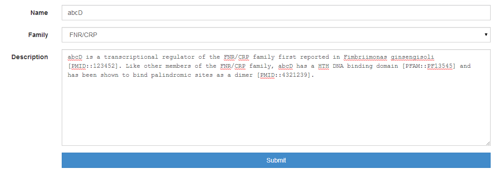
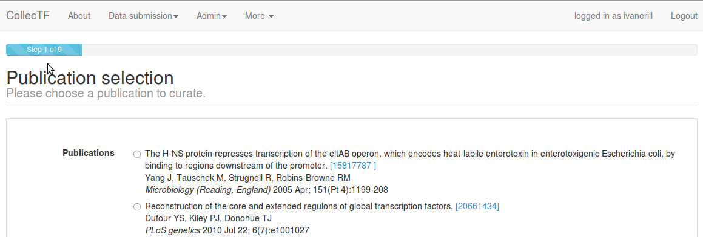
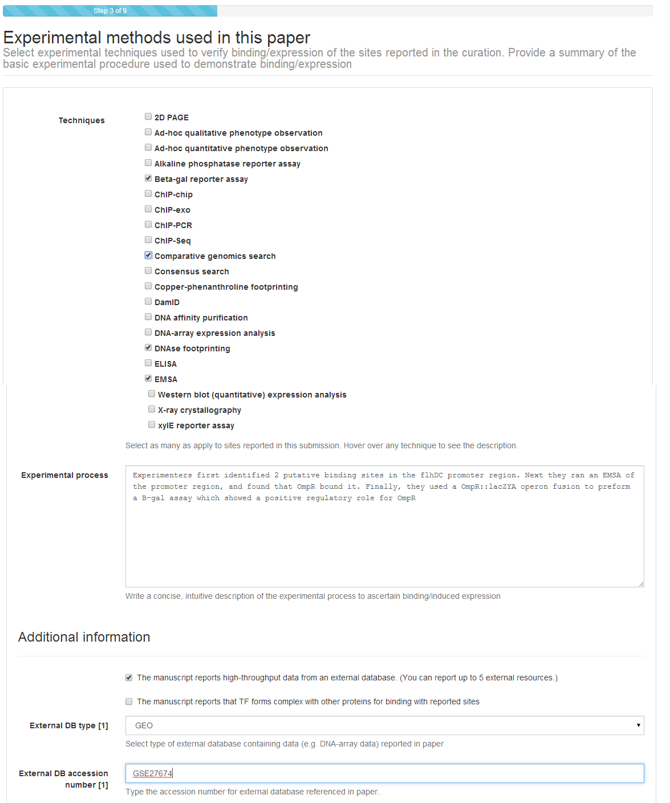

.. _curation submission guide:

Curation submission guide
=========================

A play on words using the French *collectif* [collective] and the acronym for
transcription factor [TF], CollecTF is a database of prokaryotic transcription
factor binding sites (TFBS). Its main aim is to provide high-quality,
manually-curated information on the experimental evidence for transcription
factor binding sites, and to map these onto reference bacterial genomes for
ease of access and processing. The data submitted to CollecTF gets pushed to
the major biological sequence databases, where it is embedded as *db\_xref*
links, maximizing the availability of the TF-binding site data and the impact
of the research reported by authors.

This document is a companion guide for the submission process. The
database is accessible at
`http://www.collectf.org <http://www.collectf.org/>`__. To read more
about CollecTF, please see the correspoding `Nucleic Acids Research
paper <http://nar.oxfordjournals.org/content/42/d1/d156.full.pdf>`__
(PMID: `24234444 <http://www.ncbi.nlm.nih.gov/pubmed/24234444>`__).

Data
----

This database only compiles transcription factor binding sites backed by
experimental evidence published in peer reviewed articles. CollecTF
distinguishes between two main types of experimental support: evidence of
binding (e.g. EMSA) and evidence of TF-mediated regulation (e.g. β-gal
assay). Identification of TF-binding sites through *in silico* means is
recorded as part of the curation process, but not admitted as the *single*
source of evidence for a TF-binding site. *Please do not submit data without
some form of experimental (i.e. not *in silico*) evidence, as it will be
deleted*.

Before you start
----------------

In order to perform a successful submission, several things need to be
in place. Namely, you should be a registered user, and your publication
and TF should be entered into the system (if not yet there).

User profiles
~~~~~~~~~~~~~

Before you can submit data to CollecTF you must first register as a user. To
initiate the registration process you must click on the ``Register`` link at
the upper right of the CollecTF main page. A *valid email address* is required
for user verification.

Publication submission
~~~~~~~~~~~~~~~~~~~~~~

Before submitting a curation, the publication that it reports on must be logged
in to the CollecTF database. The easiest way to introduce a publication is
using its *PMID identifier*. To enter your publication, simply log in and
select ``New publication (PubMed)`` from the ``Data submission`` menu. On the
dialog that opens, simply enter the PMID (just numbers) for your publication
and enter name of the transcription factor and species for which the sites are
reported. You can indicate, using the appropriate checkboxes, whether your
manuscript contains specific promoter information (e.g. Pribnow boxes,
annotated transcriptional start sites…) and whether it reports expression data
(evidence of TF-mediated regulation). Once you click Preview, the system will
query NCBI PubMed and populate all article fields. If you do not have a PubMed
identifier yet, please select ``New publication (non-PubMed)`` and enter the
manuscript data manually.

TF and family information
~~~~~~~~~~~~~~~~~~~~~~~~~

To submit a curation, you will also need that the TF (and its family) have been
added to the database. Please `browse the database by TF family`_ and check
whether your specific transcription factor is in the database. If it is not, use
the ``Add TF`` and/or the ``Add family`` options in ``Data submission`` to
include your TF. You can embed out‐links to PubMed and PFAM in the description
of TF and family by using the following double colon notation:
``[PMID::pmid_accession]`` and ``[PFAM::pfam_accession]``.

.. _browse the database by TF family: http://collectf.org/browse/browse_by_TF/

Curation
--------

The initial steps of the submission process require that you select a
publication and identify a mapping between the species in which you work and
available reference genomes in RefSeq.

Step 0: Publication selection
~~~~~~~~~~~~~~~~~~~~~~~~~~~~~

The submission process starts with the submitter selecting a publication for
curation. You can upload several publications for curation and perform several
curations per publication.

Step 1: Genome and TF information
~~~~~~~~~~~~~~~~~~~~~~~~~~~~~~~~~

Once a publication has been selected, the submitter must link the reported
species (both for the sites and the transcription factor) to sequences present
in the NCBI RefSeq database. This is done by providing `RefSeq accession
number`_ for the reported chromosomes (e.g. ``NC_005363.1``; *including the
version number*) and UniProt accession numbers for TF proteins
(e.g. ``P0A7C2``). Notice that RefSeq accession numbers are designated by an
underscore; the version number is the one following the period
(e.g. ``NC_005363.1``). Only NCBI RefSeq accession numbers are accepted.

.. _RefSeq accession number:
   http://www.ncbi.nlm.nih.gov/books/NBK50679/#RefSeqFAQ.what_are_the_distinguishing_fe

Identifying the RefSeq genome matching your experimental species is often a
simple step, but it may become complicated if the sequence for the exact strain
used in your work is nopt available as an NCBI RefSeq record. Most often,
parental or closely related strains will be available among NCBI RefSeq
`genomes`_. As a researcher working hands on with a particular strain, you are best
qualified to identify a parental or related strain in NCBI RefSeq Nevertheless,
if you are uncertain or there is no clear way to identify a surrogate genome in
NCBI RefSeq, please `contact the CollecTF team`_.

.. _genomes: http://www.ncbi.nlm.nih.gov/genome/
.. _contact the CollecTF team: mailto:collectf@umbc.edu

If the work you are reporting uses a strain different from the selected RefSeq
genome/TF, please type/paste the original strain in the ``Organism of
origin...`` and ``Organism TF binding sites...`` text fields. Otherwise, click
``This is the same strain...`` This allows us to keep track of the
correspondence between reported and mapped strains. If your TF is a heterodimer
or if your species has multiple chromosomes, you can add more than one
chromosome/TF accession by clicking on ``Toggle extra genome accession fields``
/ ``Toggle extra TF accession fields``.

Additional Fields
^^^^^^^^^^^^^^^^^

The submission process will ask you to verify again if the manuscript reports
promoter information or expression data. Please make sure that ``The manuscript
contains expression data`` is checked if you plan to report differential gene
expression associated with TF activity.

           

Step 2: Experimental methods
~~~~~~~~~~~~~~~~~~~~~~~~~~~~

Step 2 requires that you report *all the techniques used in the paper to verify
the TFBS* that are being *reported in this submission*. Most work reporting
TF‐binding sites involves a heterogeneous mix of techniques (e.g. a site is
first shown to bind through footprinting and EMSA, then other sites are
validated with EMSA alone).

You can select all that apply and you will be able to specify which technique
applies to each site at a later step in the curation process.  Note that you
should only enter techniques used to identify sites, and not any other
experimental techniques used in the manuscript for other purposes. In this step
we also ask that you provide a *brief written summary* of the process used to
verify the submitted TFBS (not the overall experimental process, but just how
the selected experimental techniques were combined to define reported
TFBS) [#]_. Please provide also database accession numbers for externally-linked
data if applicable (e.g. `GEO`_, `ArrayExpress`_, `PDB`_) and, if available,
details on whether the TF forms complex with other molecules in order to bind.

.. _curations: http://www.collectf.org/browse/list_all_curations/   
.. _GEO: http://www.ncbi.nlm.nih.gov/geo/
.. _ArrayExpress: https://www.ebi.ac.uk/arrayexpress/
.. _PDB: http://www.rcsb.org/pdb/home/home.do

Step 3: Entering reported sites
~~~~~~~~~~~~~~~~~~~~~~~~~~~~~~~

In this step, you will enter the primary information for CollecTF: binding sites
reported in this work *using the techniques specified in Step 2*. Again, you
will be able to define what techniques were used specifically for each binding
site at a later step.

Site types
^^^^^^^^^^

TF‐binding sites can be defined at different levels. By definition, a
TF‐binding site is simply a (relatively short) stretch of DNA to which a
transcription factor is shown to bind (e.g. a ChIP‐Seq peak or a DNAse
footprint). Many TFs target known specific sequence patterns in the DNA. Some
of these patterns are complex and require gapped alignment (e.g. because of
variable spacing) or more complex procedures in order to be defined. Other
patterns are simpler and can be represented by a gapless alignment of sites
(known as a motif), providing a much more concise definition of TF‐binding
site. In CollecTF we refer to these site types as motif‐associated (for gapless
alignments and more complex patterns), variable motif‐associated (for complex
patterns) and non‐motif associated (for unknown or absent patterns; just
evidence of binding). If you are confident that the sites you report conform to
a known motif or you establish the binding motif through experimental work
(e.g. site‐directed mutagenesis), you should report sites using an existing
motif, a new one (``Motif associated (new motif)``) or as ``Variable motif
associated``. Otherwise, please report them as ``Non-motif associated``.

.. image :: ../images/curation/motif-associated.png

.. image :: ../images/curation/var-motif-associated.png

Sequence, coordinates and quantitative data
^^^^^^^^^^^^^^^^^^^^^^^^^^^^^^^^^^^^^^^^^^^

Sites can be entered as sequences (e.g. ``ATCAGACT``) or using genome if they
have been mapped to the RefSeq reference strain in the reported work). Sites
should be entered one per line (FASTA format is also accepted for sequence
entry). In coordinate entry, coordinates are separated by tabs and the first
coordinate denotes site start position (e.g. ``12280 12260`` would denote a 20
bp site in the *reverse* strand starting at position 12280).

If you report quantitative data for sites (e.g. peak intensities, estimated Kd),
please append it with a tab/space after the sequence/coordinate entry. A brief
description of its nature (method used and range of quantitative data) should be
entered in the ``Quantitative data format`` textbox.

.. image :: ../images/curation/reported_sites.png

Step 4: Verify sites (exact)
~~~~~~~~~~~~~~~~~~~~~~~~~~~~

Transcription factor binding sites are often submitted as sequences, of which
there may be multiple instances in a genome. After submission, sites submitted
as sequences must be manually verified by the submitter to validate that the
sites entered correspond to a specific genomic location. The CollecTF
submission system will search the genome sequence specified in Step 1 looking
for the sequence of each of the sites entered. Exact matches to submitted sites
are reported back specifying their location in the genome and nearby genes.
Gene annotation details can be accessed by hovering over any gene locus. This
information can be used to verify that the sites identified in the NCBI RefSeq
genome sequence correspond to the experimentally reported sites.

.. image :: ../images/curation/exact_site_match.png

Step 5: Verify sites (inexact)
~~~~~~~~~~~~~~~~~~~~~~~~~~~~~~

In some cases, especially if using a sequence that is not an exact match to the
reported strain, some sites may not be found using an exact search. In this
case, the CollecTF submission system will use the available evidence to
construct a scoring matrix and search the genome for slightly inexact matches
(up to two mismatches away from the reported site). These will be reported in
the same way as exact matches and you will be asked to validate them in the
same manner.

.. image :: ../images/curation/inexact_site_match.png

Step 6: Site annotation
~~~~~~~~~~~~~~~~~~~~~~~

Site annotation step is an essential step for the proper curation of TF-binding
site information in CollecTF. During site annotation, specific experimental
techniques are matched to individual sites already identified in reference
genome. The quaternary structure of the TF when interacting with sites
(e.g. dimer), as well as the regulatory mode of TF-binding at each site
(e.g. repressor), if known, can also be entered independently for each site. In
addition, if quantitative data for sites has been manually entered or mapped
from high-throughput data it can also be validated here. The user can select
multiple sites using the mouse in combination with the ``Shift`` key or through
the ``Select/Unselect all`` link to easily assign attributes to several sites
at once, using the ``Apply to selected`` option on each column.

Assigning experimental techniques, TF structure or role independently to
each site may require some time, but capturing accurate information on
the experimental support and nature of TF-binding sites is the main goal
of CollecTF. We therefore kindly request that experimental
techniques be completed accurately and that attributes such as
quaternary structure be set to default values (``Not specified``) if they
cannot be submitted with accuracy. Site annotation can be greatly
facilitated by sorting the data before submission, so that sites using
similar techniques (or repressed sites, etc.) appear in consecutive
order in the ``Site Annotation``.

.. image :: ../images/curation/site_annotation.png

Step 7: Gene regulation
~~~~~~~~~~~~~~~~~~~~~~~

If the manuscript reports experimental evidence for TF‐mediated regulation of
target genes through TFBS, the CollecTF submission system will ask you to
specify, for each reported site, which genes have been shown to be regulated by
the TF.

.. image :: ../images/curation/gene_regulation.png

Step 8: Curation information
~~~~~~~~~~~~~~~~~~~~~~~~~~~~

The submission process ends with a final assessment of the curation. You will
be asked whether the submission requires review (``Revision
required``). Checking this option is indicated in several circumstances. For
instance, it is quite possible that no appropriate sequence was identified in
NCBI to perform a valid curation. In this case, the curation is marked for
revision. The TFBS data is stored, but it will not be linked to a RefSeq
sequence until a matching RefSeq record is posted.

You will also be asked whether the curation should be considered for submission
to NCBI.  Curations will only be considered for submission to NCBI if the
sequence for the reported strain is available at NCBI or if a sequence matching
the species of the reported strain is *available and at least 90% of the sites
you report have been located in the reference RefSeq record as exact matches.*

Multiple curations
^^^^^^^^^^^^^^^^^^

The system also requires that you specify whether the ``Curation for this paper is
complete``. Do not check this box if, for instance, you want to report additional
sites, regulatory modes and/or sources of experimental support in a subsequent
curation, or if you are reporting data for more than one TF or species. The
CollecTF submission system allows you to submit data from a literature source in
as many independent submissions as you require in order to facilitate the ``Site
Annotation`` step in each submission. The submission system will pre‐populate
fields in subsequent submissions, so that only reported sites and their
annotation must be entered anew in each submission (all other fields can, but do
not have to, be edited).  The same sites can be submitted multiple times
(e.g. with different experimental evidence).  The CollecTF system will
automatically integrate all the data reported for one site.

Revision required
^^^^^^^^^^^^^^^^^

When no genome remotely resembling that of the reported species is available in
RefSeq, if sequencing of the genome is still in progress or if the TF of
interest is not available in RefSeq, the submission should be tagged as
requiring revision. The data for submissions requiring revision is stored in the
database, and the CollecTF team periodically assesses whether the conditions for
revision are met in order to finalize the submission and link it to RefSeq
records.

Final submission
^^^^^^^^^^^^^^^^

After you check I want to submit this curation and click Next, a summary of your
submission will appear for your review. If you spot any errors in the
submission, please let us know immediately at collectf@umbc.edu.

.. image :: ../images/curation/curation_information.png

Once a submission is completed, the data is uploaded to CollecTF. The
submission will be then reviewed by a CollecTF curator and tagged for
submission to NCBI. On behalf of the CollecTF team, THANK YOU for your
contribution!

.. [#] For instance: "*Sites were first identified using a computer search,
       then binding was validated with EMSA. TF-mediated expression was
       confirmed with β-gal assays on w-t vs. tf-mutant*". You can check the
       provided samples or browse previous `curations`_ in the database for
       additional examples.
