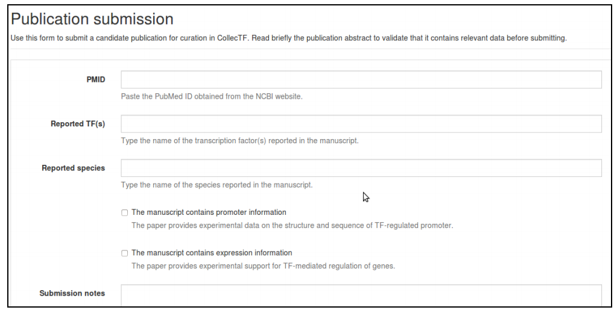
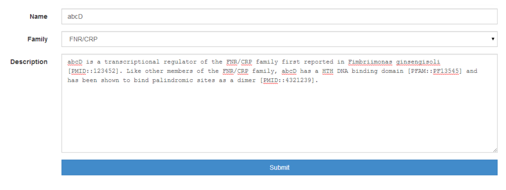

===============
Data submission
===============
.. toctree::
   :maxdepth: 1

.. _curation_submission_guide:

Curation submission guide
=========================

A play on words using the French collectif (collective) and the acronym for
transcription factor (TF), CollecTF is a database of prokaryotic transcription
factor binding sites (TFBS). Its main aim is to provide high‐quality,
manually‐curated information on the experimental evidence for transcription
factor binding sites, and to map these onto reference bacterial genomes for ease
of access and processing. The data submitted to CollecTF gets pushed to the NCBI
RefSeq database, where it is embedded as db_xref links in complete genome
sequences, maximizing the availability of the TF‐binding site data and the
impact of the research reported by authors.  This document is a companion guide
for the submission process. The database is accessible at
http://collectf.org. To read more about CollecTF, please see the `NAR paper`_
(PMID: 24234444).

.. _NAR paper: http://www.ncbi.nlm.nih.gov/pubmed/24234444

Data
----

This database only compiles transcription factor binding sites backed by
experimental evidence published in peer reviewed articles. CollecTF
distinguishes between two types of experimental support: evidence of binding
(e.g. EMSA) and evidence of TF‐mediated regulation (e.g. beta‐gal
assay). Identification of TF‐binding sites through in silico means is recorded
as part of the curation process, but not admitted as the single source of
evidence for a TF‐binding site.  Please do not submit data without some form of
experimental (not in silico) evidence.

Before you start
----------------

In order to perform a successful submission, several things need to be in place.

User profiles
~~~~~~~~~~~~~

Before you can submit data to CollecTF you must first register as a user. To
initiate the registration process you must click on the Register link at the
upper right of the CollecTF main page. A *valid email address* is required for
user verification.

Publication submission
~~~~~~~~~~~~~~~~~~~~~~

Before submitting a curation, the publication that it reports on must be logged
in to the CollecTF database. Please log in and select ``New publication`` from
the ``Data submission`` menu. You must provide a *PMID identifier* for your
publication and enter name of the transcription factor and species for which the
sites are reported. You can indicate, using the appropriate checkboxes, whether
your manuscript contains specific promoter information (e.g. Pribnow boxes,
transcriptional start site position, etc.) and whether it reports expression
data (evidence of TF‐mediated regulation).

TF and family information
~~~~~~~~~~~~~~~~~~~~~~~~~

To submit a curation, you will also need that the TF (and its family) have been
added to the database. Please `browse the database by TF family`_ and check
whether your specific transcription factor is in the database. If it is not, use
the ``Add TF`` and/or the ``Add family`` options in ``Data submission`` to
include your TF. You can embed out‐links to PubMed and PFAM in the description
of TF and family by using the following double colon notation:
``[PMID::pmid_accession]`` and ``[PFAM::pfam_accession]``.

.. _browse the database by TF family: http://collectf.org/browse/browse_TF/

Curation
--------

Step 0: Publication selection
~~~~~~~~~~~~~~~~~~~~~~~~~~~~~

Step 1: Genome and TF information
~~~~~~~~~~~~~~~~~~~~~~~~~~~~~~~~~

Step 2: Experimental methods
~~~~~~~~~~~~~~~~~~~~~~~~~~~~

Step 3: Entering reported sites
~~~~~~~~~~~~~~~~~~~~~~~~~~~~~~~

Step 4: Verify sites (exact)
~~~~~~~~~~~~~~~~~~~~~~~~~~~~

Step 5: Verify sites (inexact)
~~~~~~~~~~~~~~~~~~~~~~~~~~~~~~

Step 6: Site annotation
~~~~~~~~~~~~~~~~~~~~~~~

Step 7: Gene regulation
~~~~~~~~~~~~~~~~~~~~~~~

Step 8: Curation information
~~~~~~~~~~~~~~~~~~~~~~~~~~~~

High-throughput submission guide
================================

This section is intended as a short annex to the main curation guide, providing
specific details regarding the submission of high‐throughput data. For further
reference on the different aspects of the curation process, please see the
`curation_submission_guide`_.

Why?
-----

A significant fraction of the experimental data on transcription factor‐binding
sites currently being generated relies to more or less extent on
high‐throughput technologies and, in particular, on ChIP‐based methods (e.g.,
ChIP‐chip, ChIP‐Seq). The main goal of CollecTF is to compile and make
available through its web interface and through RefSeq genomes as much
experimental data as possible on TF‐binding sites. The CollecTF high‐throughput
submission pipeline aims at streamlining the submission of high‐throughput
data, capturing high‐ throughput specific meta‐data and incorporating it into
high‐quality annotation for TF‐binding sites.

What?
-----

High‐throughput experiments typically generate multiple layers of data. For
instance, ChIP‐Seq experiments generate raw read data, which is mapped to a
reference genome. Mapped fragments are typically assigned enrichment values
with respect to a control and fed to a peak calling algorithm to identify
consistently enriched regions. Authors typically define a minimum threshold for
enrichment, and peaks above this threshold are referred to as binding sites.
Lastly, researchers may use motif discovery and/or site search algorithms to
identify the specific sequence elements targeted by the transcription factor of
interest.

CollecTF is not a repository for raw high‐throughput data (e.g. ChIP‐seq
reads). We compile only TF‐binding sites as defined by the researchers that
report them. For ChIP data, this includes peaks above the enrichment threshold
defined by the authors as well as specific sequence elements within such bound
regions identified by the authors through in silico and/or in vitro methods.

How?
----

In most high‐throughput experiments, both enriched peaks and specific sequence
elements are identified through the combination of ChIP protocols with
bioinformatics approaches and other experimental sources of evidence. Peaks
typically incorporate quantitative enrichment data, which can be transferred to
sequence elements identified within the bound region. The CollecTF
high‐throughput pipeline allows submitting both peak and sequence elements in a
single step, and automatically assigns peak‐associated data, if available, to
sequence elements.

Regulatory mode, additional sources of evidence for specific sites and
information on regulated genes can be submitted simultaneously, or may be
submitted in a separate curation.  CollecTF will seamlessly integrate all
available annotation information for TF‐binding sites.

The process
-----------
